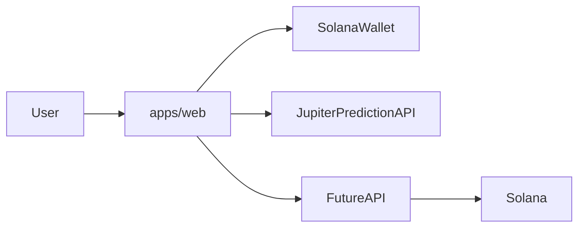

# Solbase

**Bloomberg Terminal meets social trading for prediction markets.**

A Solana-native prediction-market intelligence platform: discover markets, track performance, follow top traders, and discuss narratives—with wallet-connected trading and AI-powered portfolio insights on the roadmap.

---

## Product vision

Solbase is not a DEX-first product. It is built for **social prediction trading** and **market intelligence**:

- Browse and analyze prediction markets in one place
- Connect a Solana wallet to participate as trading flows ship
- Follow traders, climb leaderboards, and join community discussions (planned)
- Get AI-generated portfolio analysis and market context (planned)

The experience is designed to feel like a professional terminal for prediction markets, with the social layer of a trading community.

---

## MVP scope

| Area | Status |
|------|--------|
| **Markets** — browse grid, categories, filters, market detail | Implemented |
| **Wallet** — connect via Wallet Standard (Phantom, Solflare, Backpack, etc.) | Implemented |
| **Theme** — light/dark toggle | Implemented |
| **Portfolio** | Placeholder |
| **Leaderboard** | Placeholder |
| **Community** | Placeholder |
| **Profile** | Placeholder |
| **Trading / positions / settlement** | Planned |
| **AI portfolio analysis** | Planned |

---

## Core features (implemented)

- **Markets** (`/markets`) — Live prediction market discovery via Jupiter Prediction API (cards, categories, sort/filter, trades feed)
- **Market detail** (`/markets/market/[id]?event=...`) — Outcome pricing, volume, related markets within an event
- **Wallet connect** — Global nav wallet button; Wallet Standard auto-discovery
- **Legacy URLs** — Permanent redirects from `/predict` and `/predict/market/*` to `/markets` (query params preserved)

---

## Planned features

- AI portfolio analysis (P&L, risk, positioning insights)
- Trader following and public profiles
- Leaderboard rankings (performance, consistency)
- Community discussions (markets, traders, narratives)
- Market intelligence (alerts, narratives, cross-market context)
- Social prediction trading (copy/follow flows, shared theses)
- On-chain position tracking, trading, and settlement

---

## Navigation

| Route | Purpose |
|-------|---------|
| `/markets` | Default landing — prediction market discovery |
| `/portfolio` | Positions, P&L, AI portfolio analysis (placeholder) |
| `/leaderboard` | Top traders by performance (placeholder) |
| `/community` | Market and trader discussion (placeholder) |
| `/profile` | Public trading profile and reputation (placeholder) |

---

## Tech stack

- **Frontend:** Next.js 16 (`apps/web`), React 19, Tailwind CSS
- **Chain:** Solana — `@solana/react-hooks`, Wallet Standard connectors
- **Data:** Jupiter Prediction API (`NEXT_PUBLIC_JUPITER_API_KEY`)
- **Monorepo:** pnpm workspaces + Turborepo
- **Shared packages:** `packages/platform`, `packages/ui`, `packages/crypto`, `packages/ai-agents` (auxiliary scout/report workflows)
- **Jobs:** `jobs/*` — background workers (market data refresh, reports)
- **Backend:** `main.go` at repo root — Go API placeholder for future services

---

## Monorepo layout

```
apps/web            # Next.js prediction-market intelligence UI
packages/ui         # Shared UI components
packages/platform   # Shared types and schemas
packages/crypto     # Crypto utilities
packages/ai-agents  # Agent workflows (reports)
jobs/*              # Background workers
main.go             # Go API (placeholder)
```

---

## Architecture



---

## Getting started

### Prerequisites

- Node.js 20+
- [pnpm](https://pnpm.io) 9.x (or use `npx` below)

### Install and run the web app

From the repo root:

```bash
pnpm install
pnpm -F @solbase/web dev
```

Open [http://localhost:3000](http://localhost:3000) (redirects to `/markets`).

If `pnpm` is not on your PATH:

```bash
npx pnpm@9.12.2 install
npx pnpm@9.12.2 -F @solbase/web dev
```

### Environment variables

Optional overrides in `apps/web` (or root `.env.local` loaded by Next.js):

| Variable | Description |
|----------|-------------|
| `NEXT_PUBLIC_SOLANA_RPC_URL` | Solana RPC endpoint (defaults to devnet) |
| `NEXT_PUBLIC_SOLANA_WS_URL` | WebSocket endpoint (derived from RPC if unset) |
| `NEXT_PUBLIC_JUPITER_API_KEY` | Jupiter Prediction API key (required for live `/markets` data) |

Copy `apps/web/.env.example` to `apps/web/.env.local` and set your Jupiter API key.

### Other commands

```bash
pnpm dev          # Run all workspace dev tasks (Turbo)
pnpm build        # Build all packages
pnpm typecheck    # Typecheck all packages
pnpm lint         # Lint all packages
```

---

## Contributing

PRs welcome. Please open issues for bugs, features, or design discussion.

---

## License

MIT
