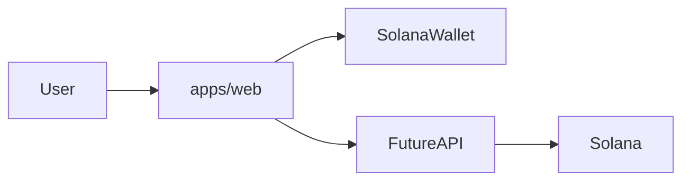

# Solbase

**A basic prediction marketplace on Solana.**

Create markets, trade on outcomes, and settle positions with a connected wallet.

---

## Overview

Solbase is a Solana-native prediction marketplace where users speculate on real-world outcomes. Markets pose simple questions—often binary (yes/no) or a small set of outcomes—and participants buy shares in the result they believe will happen.

The core loop:

1. **Markets** — Browse questions with clear resolution criteria (e.g. “Will X happen by date Y?”).
2. **Trading** — Connect a Solana wallet and take a position on an outcome.
3. **Resolution** — When the market settles, winning shares are redeemed.

This repo is early-stage: wallet connection and UI foundations exist in the web app; market listing, trading, and settlement flows are under active development.

---

## Features

| Area | Status |
|------|--------|
| **Wallet** | Connect via Wallet Standard (Phantom, Solflare, Backpack, etc.) |
| **Markets** | Browse and view prediction markets — planned |
| **Positions** | Take positions on outcomes — planned |
| **Settlement** | Resolve markets and distribute payouts — planned |

### Current status

The monorepo includes a Next.js frontend with Solana wallet integration and shared UI components. Prediction market flows (create, trade, resolve) are the next build-out.

---

## Tech stack

- **Frontend:** Next.js 16 (`apps/web`), React 19, Tailwind CSS
- **Chain:** Solana — `@solana/react-hooks`, Wallet Standard connectors
- **Monorepo:** pnpm workspaces + Turborepo
- **Shared packages:** `packages/platform`, `packages/ui`, `packages/crypto`, `packages/ai-agents` (auxiliary scout/report workflows)
- **Jobs:** `jobs/*` — background workers (e.g. market data refresh, reports)
- **Backend:** `main.go` at repo root — Go API placeholder for future market/trading services

---

## Monorepo layout

```
apps/web            # Next.js prediction market UI
packages/ui         # Shared UI components
packages/platform   # Shared types and schemas
packages/crypto     # Crypto utilities
packages/ai-agents  # Agent workflows (reports)
jobs/*              # Background workers
main.go             # Go API (placeholder)
```

---

## Architecture



---

## Getting started

### Prerequisites

- Node.js 20+
- [pnpm](https://pnpm.io) 9.x (or use `npx` below)

### Install and run the web app

From the repo root:

```bash
pnpm install
pnpm -F @solbase/web dev
```

Open [http://localhost:3000](http://localhost:3000).

If `pnpm` is not on your PATH:

```bash
npx pnpm@9.12.2 install
npx pnpm@9.12.2 -F @solbase/web dev
```

### Environment variables

Optional overrides in `apps/web` (or root `.env.local` loaded by Next.js):

| Variable | Description |
|----------|-------------|
| `NEXT_PUBLIC_SOLANA_RPC_URL` | Solana RPC endpoint (defaults to devnet) |
| `NEXT_PUBLIC_SOLANA_WS_URL` | WebSocket endpoint (derived from RPC if unset) |

### Other commands

```bash
pnpm dev          # Run all workspace dev tasks (Turbo)
pnpm build        # Build all packages
pnpm typecheck    # Typecheck all packages
pnpm lint         # Lint all packages
```

---

## Roadmap

- Market creation and listing
- Backend or on-chain position tracking
- Resolution and payout flow
- Liquidity mechanism (order book or pool-based trading)

---

## Contributing

PRs welcome. Please open issues for bugs, features, or design discussion.

---

## License

MIT
