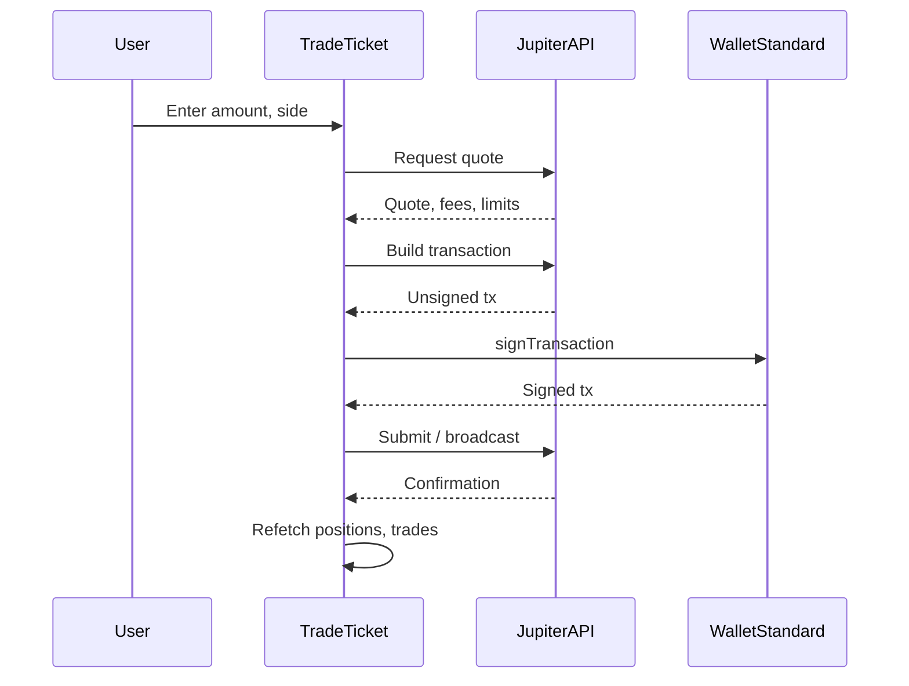

# Trading & Execution Plan

This document describes how Solbase will enable prediction-market trading on Jupiter, what exists today, and what must be built before real execution goes live.

---

## 1. Current state (MVP preview)

| Capability | Status |
|------------|--------|
| Market browse & detail (live Jupiter feed) | Live |
| Buy YES / Buy NO CTAs on market detail | UI only — prominent, labeled **Coming soon** |
| Trade ticket drawer | Opens when wallet is connected; shows side, title, implied %, amount, est. payout placeholder |
| Execute / sign / submit | **Disabled** — button copy: *Execution not enabled yet* |
| Portfolio & market-detail positions | **Mock** via `getMockPortfolio()`; shared `PositionRecord` types |
| Jupiter position API | Not wired — adapter stubs in `apps/web/lib/positions/adapters.ts` |

**User-facing copy:** *Trading preview — execution disabled* and *Preview ticket · no orders submitted* so the product does not imply live trading.

---

## 2. Required Jupiter APIs

Integrate alongside the existing Prediction API client in [`apps/web/lib/prediction/api.ts`](apps/web/lib/prediction/api.ts) (same `API_BASE_URL` / `x-api-key` pattern).

| Endpoint (conceptual) | Purpose |
|----------------------|---------|
| `GET /positions?owner={wallet}` | Open positions for portfolio + market detail context |
| `GET /orders/quote` or equivalent | Price/size quote for a proposed trade |
| `POST /orders/build` or equivalent | Unsigned transaction payload for wallet signing |
| `GET /markets/{id}` / event feed | Already used via `useEvent` — keep as source of truth for marks |

Exact paths and schemas must be confirmed against Jupiter Prediction API documentation when execution work starts. Until then, use `JupiterPositionStub` in adapters as the contract sketch.

---

## 3. Order placement flow (target)

1. **Quote** — Validate market open, min size, slippage bounds.
2. **Build** — Server or client builds Solana transaction (program IDs per Jupiter).
3. **Sign** — User approves in connected wallet; no custodial keys in Solbase.
4. **Confirm** — Poll RPC or API for confirmation; show success/failure in ticket.
5. **Sync** — Invalidate position queries; update market detail position panel.

Until step 4 is implemented and audited, keep the execute button disabled.

---

## 4. Wallet signing flow

- **Stack:** Wallet Standard connectors via `@solana/react-hooks` (same as nav [`WalletConnectButton`](../apps/web/components/ui/wallet-connection/wallet-connect-button.tsx)).
- **Disconnected:** Trade CTAs open connect dialog; no ticket with execution path.
- **Connected:** Ticket opens; future execute calls `wallet.signTransaction` (or provider-specific API).
- **Errors:** Surface user-reject, insufficient SOL, blockhash expiry, simulation failure — map to plain language in ticket.
- **Networks:** Document devnet vs mainnet in env (`NEXT_PUBLIC_*`); never mix cluster URLs in one session.

---

## 5. Position sync

- **Fetch:** `getPositions(wallet)` → `JupiterPositionStub[]` → `mapJupiterPositionToPortfolioPosition()` for each row.
- **Portfolio:** Replace mock mapping in [`use-portfolio.ts`](../apps/web/hooks/portfolio/use-portfolio.ts) while keeping mock fallback for offline demos if needed.
- **Market detail:** [`use-market-position-context.ts`](../apps/web/hooks/markets/use-market-position-context.ts) uses `findPositionForMarket()` from [`adapters.ts`](../apps/web/lib/positions/adapters.ts) (slug + title match).
- **Refresh:** Refetch on wallet change, after successful trade, and on interval (e.g. 30s) when tab visible.
- **Types:** Single source in [`types.ts`](../apps/web/lib/positions/types.ts) — `PositionRecord`, `MarketPositionContextState`.

---

## 6. Safety & compliance

- **No misleading UX:** Do not remove “preview” / “execution disabled” labels until real trading is production-ready.
- **Geography & eligibility:** Product/legal to define restricted jurisdictions before enabling execute; gate in API or UI as required.
- **Limits:** Max position size, rate limits, and confirmation step for large notional.
- **Non-custodial:** Solbase does not hold user funds; all settlement on-chain via Jupiter/Solana programs.
- **Risk disclosure:** Binary outcomes can lose 100% of stake; show near trade ticket before first live trade.
- **Testing:** Devnet end-to-end tests before mainnet; no paid third-party execution APIs in MVP unless explicitly approved.

---

## 7. Implementation order (recommended)

1. `getPositions(wallet)` + adapter mapping — portfolio and market detail show live positions.
2. Quote preview in trade ticket (read-only, execute still disabled).
3. Build + sign + submit behind feature flag.
4. Remove mock default for connected wallets; keep mock for Storybook/local only if needed.

See also [`docs/mvp-spec.md`](mvp-spec.md) Phase 3 — Trading and intelligence.
